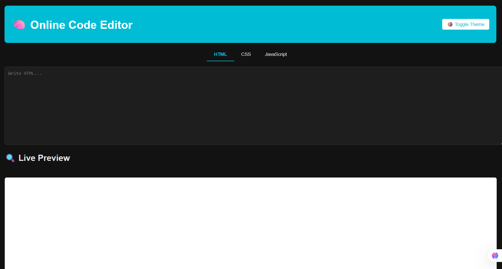

# 🧠 Online Code Editor (Mini-Pro)

A fully functional, browser-based code editor with live preview.  
Write HTML, CSS, and JavaScript in separate tabs and see the output instantly!

🔗 **Live Demo**: [Click here](https://online-code-editor-sanjeevi-vps-projects.vercel.app/)

---

## ✨ Features

- 🔄 **Live Preview** using `<iframe>`
- 💾 **Save code** using `localStorage` (code persists on refresh)
- 🌗 **Dark / Light Theme Toggle**
- 🗂️ **Tabbed Interface** (HTML / CSS / JavaScript)
- ⬇ **Download code** as a complete HTML file

---

## 🖼️ Screenshots

> Add screenshots if needed. Example:
> 

---

## 🚀 Tech Stack & Hosting

  <!-- HTML -->
  

  <!-- CSS -->
  

  <!-- JavaScript -->
  

  <!-- Hosting: Vercel -->
  

